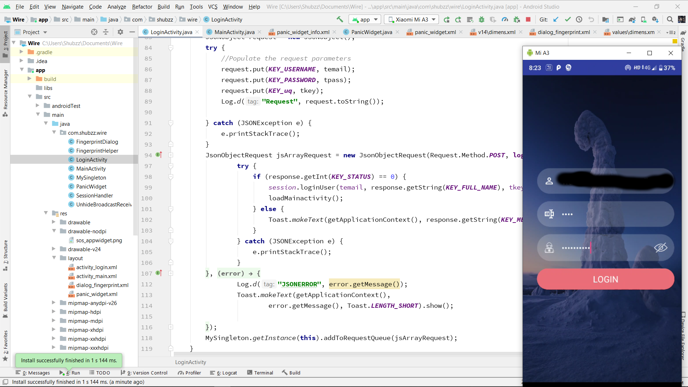

#  Wire-Child

Child android app


## Modules

1. [Server Side](https://github.com/Shubzz-02/Wire-backend.git) 

2. [Parent App](https://github.com/Shubzz-02/Wire-Parent.git)

3. [Child App](https://github.com/Shubzz-02/Wire-Android.git)


## Prerequisite

```bash
1. Should have android studio installed

```

## Installation


```bash
1. Open android Studio and choose option "Get From Version Control"

2. In URL field paste this link "https://github.com/Shubzz-02/Wire-Android.git"

3. Click Clone option
```

##Screen-Shots



